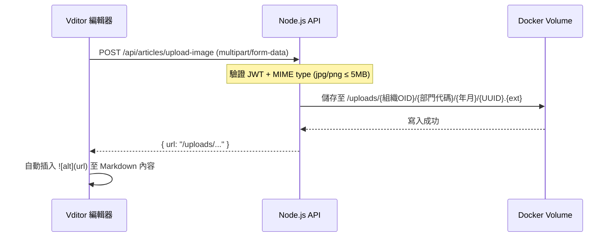
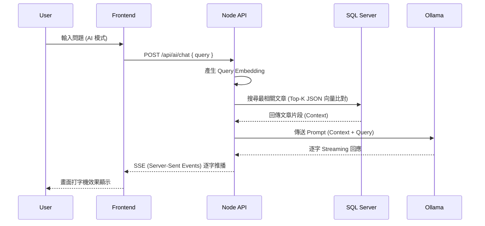
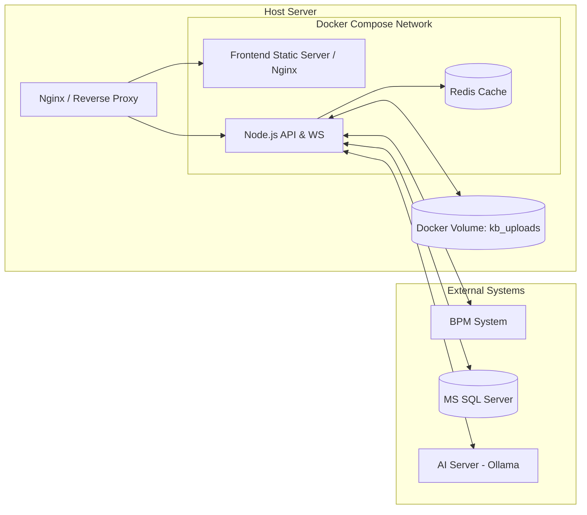

# 02 系統架構設計 (Architecture Design)
> 集團知識庫系統 GigaSolar Knowledge Base

---

## 1. 系統總體架構 (High-Level Architecture)

本系統採用前後端分離架構，以 Node.js (Express) 作為後端 API 伺服器，Vue 3 作為前端 SPA。整體系統部署於 Docker 容器環境中，並整合企業現有 BPM 系統進行身分驗證與同仁資料同步。

```mermaid
graph TD
    Client[Web Browser (Vue 3)] -->|HTTP/REST| API[Node.js / Express API]
    Client -->|WebSocket| WS[WS Server (編輯感知)]
    Client -->|SSE| API_AI[AI Streaming API]

    API <-->|JWT Auth / User Data| BPM[BPM 系統 API]
    API <-->|Read/Write| SQL[(MS SQL Server)]
    API <-->|Session / Cache / PubSub| Redis[(Redis)]
    API <-->|File Read/Write| Storage[Docker Volume (kb_uploads)]
    
    API_AI <-->|Prompt / Context| Ollama[Ollama Server (Qwen3.6:35b)]
    Ollama -.->|Hardware| GPU[AI 主機 GPU]
```

## 2. 前端架構 (Frontend Architecture)

- **核心框架**：Vue 3 (Composition API) + Vite
- **UI 元件庫**：Element Plus
- **狀態管理**：Pinia (推薦) 或基於 Composition API 的自訂 Store
- **路由管理**：Vue Router (支援懶加載)
- **Markdown 編輯**：Vditor (支援即時預覽、圖片拖曳上傳 Hook)
- **網路請求**：
  - Axios (配置 Retry Interceptor 處理儲存重試)
  - 原生 `EventSource` (處理 Server-Sent Events AI 回應)
  - 原生 `WebSocket` (處理多人編輯感知)
- **認證儲存**：Token 儲存於 `sessionStorage`，確保 Tab 關閉或另開分頁即登出。

## 3. 後端架構 (Backend Architecture)

- **核心框架**：Node.js + Express
- **設計模式**：MVC / Controller-Service-Repository 模式
- **ORM**：Sequelize
- **即時通訊**：`ws` 套件 (管理文件編輯的 Room 機制)
- **快取層**：Redis 負責三項功能：
  - BPM 同仁列表快取（TTL：**1 小時**，供 @提及下拉選單與權限指派使用）
  - Session / JWT 黑名單管理
  - WebSocket Pub/Sub（跨容器廣播編輯感知事件）
- **檔案服務**：透過 Express `express.static` 提供靜態檔案讀取，並配置 JWT Middleware 驗證讀取權限。

### 3.2 Markdown 圖片上傳流程

Markdown 內嵌圖片屬獨立上傳路徑，與「附件」功能分開處理：



### 3.1 核心模組劃分
- **Auth Module**：負責對接 BPM 登入、核發 JWT、驗證 Token。
- **Article Module**：處理文章 CRUD、版本歷史、垃圾桶邏輯。
- **Directory Module**：處理樹狀目錄節點增刪改查。
- **Attachment Module**：處理檔案上傳至 Docker Volume、權限檢核。
- **AI Module**：封裝對 Ollama 的 HTTP 請求，將結果以 SSE 串流轉發給前端。
- **Notification Module**：處理 @提及解析、寫入 DB 並提供前端未讀/已讀列表。

## 4. 資料庫與儲存架構 (Database & Storage)

### 4.1 關聯式資料 (MS SQL Server)
- 作為系統主要資料庫。
- 儲存文章 metadata、Markdown 原始碼、版本歷史快照、目錄結構、權限設定等。
- **向量儲存**：利用 SQL Server 的 JSON 欄位功能儲存文章 Embedding 向量，並搭配 T-SQL 進行近似度計算或檢索。
- **軟刪除機制**：透過 `is_published = false` 狀態進行邏輯下架，實際資料不刪除，移至垃圾桶。

### 4.2 檔案實體儲存 (Docker Volume)
- 掛載路徑：`/app/uploads` (Volume Name: `kb_uploads`)
- 路徑規劃：`/uploads/{組織OID}/{部門代碼}/{年月}/{檔案UUID}.{副檔名}`
- 備份策略：由維運團隊自行設定 (例如定期快照或 NAS 掛載)。

## 5. AI 整合架構 (AI Integration)

採用 **RAG (Retrieval-Augmented Generation)** 架構結合本地端 Ollama 模型。



- **模型配置**：Ollama 部署於專屬 AI 主機，Node.js 負責轉發請求，預設模型為 `qwen3.6:35b`。
- **非同步 Embedding**：文章儲存後，Node.js 於背景呼叫 Embedding 模型，並更新 SQL Server 紀錄。

### 5.1 KB 文件向量同步（RAG Sync）

除上述即時問答外，KB 另建有獨立的**向量同步機制**，將已上架文章/PDF/Word 附件送進外部 **AiRAG**（獨立 Python FastAPI 專案）切分、embedding 後寫入 **Qdrant** 向量庫，並以排程比對 KB DB 與 Qdrant 的落差。詳細流程、資料表與 API 契約見 [docs/DevelopmentProcess/RAG_SYNC_PLAN.md](DevelopmentProcess/RAG_SYNC_PLAN.md)。重點：

- KB 後端新增 `rag_sync_status`/`rag_sync_config`/`rag_sync_logs` 三張表，`node-cron` 排程 + 文章/附件 CRUD 異動即時通知雙軌驅動。
- KB 後端透過 `services/aiRagIngestClient.js` 呼叫 AiRAG 觸發端點，透過 `services/qdrantService.js` 直連 Qdrant 做比對/刪除；AiRAG 則反向呼叫 KB 的 `/api/v1/rag-sync-content/*` 端點拉取原始內容。
- 管理介面（`AdminView.vue` 同步排程 / 同步比對 / 同步日誌）與文章/附件詳情頁的同步狀態徽章供人工監控與手動重試。

## 6. 安全性與身分驗證 (Security & Auth)

- **無密碼登入**：直接使用 BPM API 驗證，系統內部不儲存密碼。
- **JWT 驗證**：登入成功後，後端核發 JWT Token，**TTL 為 8 小時**；過期後前端自動跳轉至登入頁。
- **Session 隔離**：前端將 Token 存於 `sessionStorage`，開啟新分頁需重新登入，符合嚴格的企業資安政策。
- **API 攔截**：所有 `/api/*` 及 `/uploads/*` 均需驗證 JWT，無效則回傳 HTTP 401。
- **權限控制 (RBAC)**：
  - 基於 `組織OID` 及 `部門代碼` 進行資料隔離。
  - 基於角色 (`GUEST`, `MEMBER`, `MANAGER`, `ADMIN`) 進行操作權限控管。

### 6.1 角色推導邏輯

後端於登入時，依 BPM API 回傳欄位自動推導角色，**不另建帳號體系**：

| 角色 | 推導條件 |
|------|---------|
| `GUEST` | 未攜帶 JWT / JWT 無效 |
| `MEMBER` | JWT 有效且 `級職 ≥ 6` |
| `MANAGER` | JWT 有效且（`主管工號` 有值等於自身 `員工工號` 出現在他人資料中 **或** `級職 < 6`）|
| `ADMIN` | 後台手動指定，寫入 DB `users.role = 'ADMIN'` |

> ADMIN 角色優先級最高，不受級職條件影響。角色資訊於 JWT Payload 中帶入，並於每次請求時於 Middleware 中驗證。

### 6.2 敏感操作防護
- 永久刪除、版本回滾：需二次確認對話框（前端）+ 後端額外校驗角色。
- 附件上傳：後端驗證 MIME type，僅允許 `.doc`, `.docx`, `.xls`, `.xlsx`, `.pdf`, `.jpg`, `.png`, `.txt`。

## 7. 部署架構 (Deployment)

使用 Docker Compose 將前後端及相關服務容器化部署。



- **環境變數管理**：透過 `.env` 檔案控制資料庫連線、BPM API URL、Ollama Endpoint 等配置。
- **日誌管理**：Node.js 寫入標準輸出 (stdout)，交由 Docker Daemon 統一收集。

## 8. 開發目錄結構 (Directory Structure)

專案採用前後端分離結構，整體根目錄結構規劃如下：

```text
GigaSolarKnowledgeBase/
├── frontend/                 # 前端專案 (Vue 3 + Vite)
│   ├── public/               # 靜態資源 (如 favicon)
│   ├── src/
│   │   ├── assets/           # 樣式 (CSS/SCSS)、圖片等靜態資源
│   │   ├── components/       # 共用 Vue 元件 (Header, Sidebar 等)
│   │   ├── composables/      # Vue Composition API 邏輯抽取
│   │   ├── router/           # Vue Router 設定
│   │   ├── store/            # 狀態管理 (Pinia)
│   │   ├── views/            # 頁面層級元件 (Home, Article, Settings 等)
│   │   ├── services/         # API 請求封裝 (Axios)
│   │   ├── services/api.js   # API 入口點，mock資料先在這裡做測試
│   │   ├── utils/            # 工具函式 (e.g., Markdown 解析, 日期格式化)
│   │   ├── App.vue           # 根元件
│   │   └── main.js           # 進入點
│   ├── package.json
│   └── vite.config.js
│
├── backend/                  # 後端專案 (Node.js + Express)
│   ├── src/
│   │   ├── config/           # 環境與資料庫設定
│   │   ├── controllers/      # API 請求處理邏輯
│   │   ├── middlewares/      # 攔截器 (JWT 驗證, 錯誤處理)
│   │   ├── models/           # Sequelize Data Models
│   │   ├── routes/           # Express 路由定義
│   │   ├── services/         # 核心業務邏輯 (AI, BPM 整合, 權限判斷)
│   │   ├── websockets/       # WebSocket 編輯感知邏輯
│   │   └── index.js          # 後端伺服器進入點
│   ├── package.json
│   └── .env.example
│
├── docs/                     # 專案文件 (PRD, 架構圖, API 文件等)
├── docker-compose.yml        # Docker 部署設定
└── README.md                 # 專案說明
```
