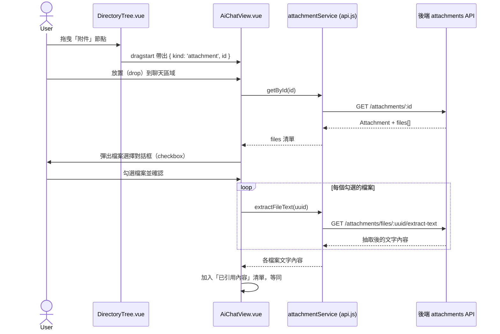

# AI 問答獨立頁面與目錄拖曳規劃

## 0. 文件資訊

- **狀態**：TASK-1～TASK-5 程式碼已完成並通過 `npm run build`；因登入需要真實 BPM 帳密，AI 助手無法自行完成瀏覽器互動驗證，TASK-6 待人工實際登入測試（見「9. 實作完成紀錄」）
- **建立日期**：2026-07-30
- **決策確認日期**：2026-07-30
- **實作完成日期**：2026-07-30
- **目標**：
  1. 將 AI 問答功能獨立成一個 URL 頁面，於 `main` 內容區顯示（左側選單與目錄樹保留），而非現行的右側彈出視窗。
  2. 讓使用者在 `#文章` 指定文章後，除了既有的「快速指令」按鈕，也能直接輸入自己的問題。
  3. 讓左側目錄樹的文章與附件節點可直接拖曳到 AI 問答頁面，效果等同 `#文章`；附件節點需先選擇要引用的檔案，而非整包丟給 AI。
- **相關文件**：[docs/03_API_CONTRACT.md](../03_API_CONTRACT.md)、[docs/04_DB_SCHEMA.md](../04_DB_SCHEMA.md)、[INCREASEDEMAND.md](./INCREASEDEMAND.md)（既有 AI 面板需求歷史記錄）

---

## 1. 現況分析

| 項目 | 現況 |
|---|---|
| AI 面板 | `frontend/src/components/panels/AiChatPanel.vue`（約 1300 行），以 `v-model` 控制的右側 `fixed` 彈出視窗（`.panel-overlay`），在 `HomeView.vue`、`ArticleView.vue` 內以「AI 助手」浮動徽章觸發。 |
| Layout | `AppLayout.vue`：`TheHeader` + `TheSidebar`（導覽選單）+ `DirectoryTree`（目錄樹側欄）+ `main.kb-main`（`router-view`）。AI 面板目前是蓋在整個畫面上的 overlay，不屬於 `router-view` 內容。 |
| 選單 | `TheSidebar.vue` 的 `navItems` 為單一陣列：`首頁`、`建立文章`、`上傳文件`，公開文件範圍下只顯示「首頁」。 |
| `#文章` 指定 | `AiChatPanel.vue` 的 `onInputChange` 偵測輸入框結尾 `#關鍵字`，彈出文章下拉選單（僅來自 `dirStore.filteredTree` 內 `type==='article'` 且有權限者），選取後存入 `referencedArticles`。 |
| 自訂問題 | 程式碼層面**其實已支援**：`sendMessage()` 在 `chat` 模式下，若 `referencedArticles.length > 0`，會組合 `(capturedInput || '請分析以上文章內容') + articleContext`，也就是使用者打的文字會和指定文章內容一起送出。畫面上「快速指令」按鈕與輸入框是同時顯示的，只是目前的提示文案／版面容易讓人誤以為只能點按鈕。 |
| 目錄拖曳 | `DirectoryTree.vue` 使用 `el-tree` 內建 `draggable`，但 `allowDrag()` 只允許 `type === 'directory'`，`article`/`attachment` 節點目前完全不可拖曳（僅供點擊導覽）。 |
| 附件檔案 | `Attachment` 對 `AttachmentFile` 為一對多，`attachmentService.getById(id)` 才會回傳 `files: [{ id, uuid, name, size, mimeType, url }]`（列表 API 不含）。 |
| 文字抽取 | 後端 `aiController.js` 的 `writingAssist` 已用 `pdf-parse`／`mammoth` 從**上傳的檔案（multer memory buffer）**抽取文字，但目前沒有「從已存在磁碟上的附件檔案（`storage_path`）抽取文字」的端點。 |

---

## 2. 需求拆解與設計方案

### 2.1 新增 AI 問答獨立頁面

- 新增路由：`path: 'ai-chat'`、`name: 'AiChat'`，掛在 `AppLayout` 子路由下（與 `home`、`article/*` 同層），沿用登入守衛。
- 新增頁面元件 `frontend/src/views/AiChatView.vue`，在 `main.kb-main` 內以全高版面呈現聊天內容（取代現行 overlay 的固定寬度側欄樣式）。
- **選單調整**（`TheSidebar.vue`）：在「首頁」下方新增「AI問答」連結，並用分隔線區隔「建立文章」「上傳文件」：
  ```
  首頁
  AI問答
  ──────
  建立文章
  上傳文件
  ```
  對應調整 `navItems` 資料結構，加入 `{ type: 'divider' }` 標記。
  - **決策**：「AI問答」在「公開文件」範圍（`viewScope === 'public'`）下**仍需顯示**，與「建立文章」「上傳文件」（僅部門範圍顯示）不同。`computedNavItems` 的過濾邏輯需調整為：公開範圍只隱藏「建立文章」「上傳文件」，「首頁」與「AI問答」兩者皆常駐顯示。
  - ⚠️ **實作細節（外部審查發現）**：現行模板直接在 `<router-link :to="item.to">` 上做 `v-for`。若 `computedNavItems` 混入 `{ type: 'divider' }`（無 `.to` 屬性）會讓 `router-link` 收到 `undefined` 的 `to`，觸發 Vue Router 警告。需改為：
    ```html
    <template v-for="(item, idx) in computedNavItems" :key="item.to || `divider-${idx}`">
      <div v-if="item.type === 'divider'" class="nav-divider" />
      <router-link v-else :to="item.to" custom v-slot="{ isActive, navigate }">
        ...（原本按鈕內容）
      </router-link>
    </template>
    ```
- **共用邏輯重構（避免複製貼上 1300 行程式碼）**：將 `AiChatPanel.vue` 目前的狀態與方法（`messages`、`sendMessage`、`sendCommand`、`#` mention、串流處理、Markdown 渲染等）抽出為 composable：`frontend/src/composables/useAiChat.js`。
  - `AiChatPanel.vue`（彈出視窗）與 `AiChatView.vue`（獨立頁面）都改為呼叫此 composable，各自保留自己的版面／樣式（overlay vs 全頁）。
  - 現行 `AiChatPanel.vue` 對外的 props/emits（`allowedModes`、`articleId`、`contextContent`、`apply`、`tagAdded` 等）維持不變，`HomeView.vue`／`ArticleView.vue` 呼叫端不需改動。
  - `AiChatView.vue` 僅開放 `chat` 模式（無需 `generate`／`correct`，因為沒有對應的文章編輯上下文）。
- ⚠️ **版面 CSS 注意（外部審查發現）**：`AppLayout.vue` 的 `.kb-main` 預設 `overflow-y: auto` 且有 `padding: var(--main-content-padding)`。`AiChatView.vue` 若做成「訊息區可捲動＋底部輸入框固定」的全高版面，會與 `.kb-main` 自身的捲軸疊加成雙重捲軸，且輸入框可能被擠出可視範圍。
  - 處理方式：在 `AppLayout.vue` 依路由 `meta.fullBleed`（新增 route meta）動態加上 `kb-main--full-bleed` class，該 class 移除 `.kb-main` 的 `padding`／改 `overflow: hidden`；`AiChatView.vue` 內部自行以 `height: 100%; display: flex; flex-direction: column;` 管理版面，僅在訊息列表區塊自己 `overflow-y: auto`。

### 2.2 `#文章` 支援自訂問題

- 確認現況：`sendMessage()` 已經會把使用者輸入的自由文字與 `#` 指定的文章內容一起送出，「快速指令」只是額外的預設捷徑，並非唯一途徑。
- 本次調整聚焦在**明確化 UI 提示**，避免使用者誤解：
  1. 調整 `input-hint` 與 `welcomeText`，明確寫出「可直接輸入你的問題，或點擊下方快速指令」。
  2. 「快速指令」區塊加上小標籤或說明文字，標示為「或使用快速指令」，降低視覺上「只能點按鈕」的錯覺。
  3. `inputPlaceholder` 在已指定文章時，動態改為「輸入你想問的問題，例如：特休怎麼計算？」。
- 不涉及後端調整；`sendMessage`／`sendCommand` 邏輯不變。

### 2.3 目錄樹拖曳到 AI 問答頁面

僅在 **AI 問答獨立頁面**（`AiChatView.vue`）啟用拖放目標；彈出視窗版本不做此功能（面板寬度小、且多半是在文章頁輔助當前文章，非本次需求範圍）。

**前端 - 目錄樹（`DirectoryTree.vue`）**
- 在 `article`／`attachment` 節點的 `<span class="tree-node">` 上新增原生 HTML5 `draggable="true"`（獨立於 `el-tree` 本身的 `draggable`／`allowDrag`，兩者互不影響：`el-tree` 的拖曳只管理 `directory` 節點的重新排序）。
- 無存取權限（`!checkItemAccess(data)`）的節點不可拖曳。
- `dragstart` 時將節點資訊寫入 `event.dataTransfer`（JSON：`{ kind: 'article' | 'attachment', id, title }`）。
- ⚠️ **事件衝突（外部審查發現，已查證 Element Plus 原始碼確認屬實）**：`el-tree` 內部的 `treeNodeDragStart` 監聽器綁在 `.el-tree-node__content`（節點外層容器）上，且對每個節點都判斷 `allowDrag(node)`——文章／附件節點目前回傳 `false`，該監聽器會呼叫 `event.preventDefault()` 並 `return false`，直接中止整個拖曳。我們新增的原生 `draggable` 元素是內層 `<span>`，`dragstart` 會先在該內層元素觸發後才向上冒泡到 `.el-tree-node__content`，若不阻止冒泡，el-tree 的監聽器仍會攔截並取消拖曳。
  - **必要防範**：在自訂的 `dragstart` handler 開頭呼叫 `event.stopPropagation()`，避免事件冒泡到 `el-tree` 的內建監聽器。

**前端 - AI 問答頁面（`AiChatView.vue`）**
- 聊天訊息區域註冊 `dragover`（`preventDefault` 顯示可放置樣式）與 `drop`。
- `drop` 時依 `kind` 分流：
  - `article`：比照 `#文章` 選取，直接加入 `referencedArticles`。
  - `attachment`：呼叫 `attachmentService.getById(id)` 取得該附件的 `files` 清單，彈出「選擇要引用的檔案」對話框（checkbox 清單，顯示檔名／大小，可全選／取消全選），使用者確認後，才把勾選的檔案加入引用清單（不會把附件底下所有檔案都送給 AI）。
- 新增「已引用內容」的顯示區塊，需同時容納「文章」與「附件檔案」兩種型態的 tag（不同 icon 區分：📄 文章／📎 附件檔案）。
- 首次進入頁面或訊息為空時，於歡迎區塊加入提示文字：「💡 提示：可從左側目錄樹拖曳文章或附件到這裡，直接向 AI 提問」。
- ⚠️ **拖放 UX 細節（外部審查發現，屬標準 HTML5 DnD 實務，採納）**：
  1. `dragover` handler 除了 `event.preventDefault()`，需同步設定 `event.dataTransfer.dropEffect = 'copy'`，否則 Chrome/Edge 會顯示不可放置游標且無法觸發 `drop`。
  2. 放置區內若有子元素（訊息氣泡、輸入框等），會頻繁觸發子元素的 `dragenter`／`dragleave` 導致外框高亮閃爍。改用 `dragCounter` 計數器（`dragenter` +1、`dragleave` -1，`counter > 0` 才顯示高亮，`drop` 時歸零)，不要單純用 `dragleave` 直接關閉高亮。

**後端 - 附件檔案文字抽取（新增）**
- 現有 `pdf-parse`／`mammoth` 抽取邏輯目前寫在 `aiController.writingAssist` 內，僅處理「上傳的檔案 buffer」。需新增一個從**已儲存磁碟檔案**（`AttachmentFile.storage_path`）抽取文字的端點：
  - 新增 `GET /api/v1/attachments/files/:uuid/extract-text`（沿用既有 `authMiddleware`，並比照下載端點做權限檢查——需驗證使用者對該檔案所屬 `Attachment` 有存取權限，避免繞過目錄樹的權限檢查直接用 uuid 存取內容）。
  - 抽取邏輯（`mammoth`／`pdf-parse`）從 `aiController.js` 抽成共用 helper（例如 `backend/src/helpers/fileTextExtractor.js`），供 `writingAssist` 與新端點共用，避免重複程式碼。
  - 僅支援 `mime_type` 為 Word（`.doc`/`.docx`）與 PDF 的檔案；其餘格式（圖片、Excel、壓縮檔等）回傳明確錯誤（例如 400 + `message: '此檔案格式暫不支援 AI 引用'`），前端選擇對話框對應顯示為不可勾選並附上提示。
  - 沿用「產生文章」模式的 5 MB 檔案大小限制，避免超大檔案拖垮抽取效能。
  - ⚠️ **路由宣告順序（外部審查發現，已查證 `attachments.js` 現況屬實）**：Express 路由由上而下匹配。新端點必須放在 `router.get('/:id', ...)` **之前**（與現有 `router.get('/files/:uuid/download', ...)` 同一區塊），否則 `/files/:uuid/extract-text` 會被 `/:id` 攔截，`id` 參數收到字面值 `"files"` 導致 400/500。目前 `attachments.js` 的 `/files/:uuid/download` 已正確放在 `/:id` 之前，新端點比照同樣位置即可。
  - ⚠️ **跨部門權限檢查（外部審查發現，已查證屬實）**：`attachmentController.js` 的 `getAttachmentById`／`getAllAttachments` 都會先呼叫 `getUserExtraDeptCodes(req.user.員工工號)` 取得跨部門授權清單，再傳入 `canAccess(user, resource, extraDeptCodes)` 做第三參數比對；但既有的 `downloadFile`（line 529）呼叫 `canAccess(req.user, file.Attachment)` **漏了第三參數**，等同跨部門授權使用者下載檔案會被誤判 403（屬既有程式碼的既存 bug，不在本次規劃範圍內，另見下方「附加發現」）。新端點 `extractFileText` 需依照 `getAttachmentById` 的正確寫法，補上 `getUserExtraDeptCodes` 查詢並傳入 `canAccess` 第三參數，避免重蹈覆轍。
- ⚠️ **文字抽取邊界情境**：掃描圖片型 PDF 或加密 PDF 經 `pdf-parse` 解析後文字可能為空字串。前端收到空內容時，於檔案選擇結果顯示「⚠️ 無法從此檔案擷取文字（可能是掃描圖片檔或加密文件）」，不將其加入引用清單，避免送出空白 context 給 AI。

---

## 3. 拖曳附件流程圖



---

## 4. 異動檔案清單（預估）

**前端**
- `frontend/src/router/index.js`：新增 `ai-chat` 路由。
- `frontend/src/views/AiChatView.vue`（新增）：獨立頁面版聊天畫面，狀態來自 `store/aiChat.js`。
- `frontend/src/composables/useAiChat.js`（新增）：從 `AiChatPanel.vue` 抽出的共用邏輯（狀態/邏輯分離設計，接受外部傳入的 reactive 狀態）。
- `frontend/src/store/aiChat.js`（新增）：Pinia store，供 `AiChatView.vue` 使用，讓對話跨頁面切換保留。
- `frontend/src/components/panels/AiChatPanel.vue`：改為呼叫 `useAiChat.js`（狀態仍為本地 `reactive()`，行為不變），移除重複邏輯；調整 hint 文案。
- `frontend/src/components/layout/TheSidebar.vue`：新增「AI問答」項目與分隔線樣式。
- `frontend/src/components/directory/DirectoryTree.vue`：新增 `article`／`attachment` 節點的原生 `draggable`／`dragstart`。
- `frontend/src/services/api.js`：新增 `attachmentService.extractFileText(uuid)`。

**後端**
- `backend/src/helpers/fileTextExtractor.js`（新增）：共用的 PDF/Word 文字抽取函式。
- `backend/src/controllers/attachmentController.js`：新增 `extractFileText` handler（讀 `storage_path`、權限檢查、呼叫共用 helper）。
- `backend/src/routes/attachments.js`：新增 `GET /files/:uuid/extract-text` 路由。
- `backend/src/controllers/aiController.js`：`writingAssist` 改用共用 helper（去重複）。

**文件**
- `docs/03_API_CONTRACT.md`：補上新端點 `GET /api/v1/attachments/files/:uuid/extract-text`。

---

## 5. 分階段實作步驟

1. **TASK-1**：抽出 `useAiChat.js` composable（狀態/邏輯分離設計，接受外部傳入的 reactive 狀態），`AiChatPanel.vue` 改用該 composable＋本地 `reactive()` 狀態，確認彈出視窗行為與現行完全一致（回歸測試）。
2. **TASK-2**：新增 `store/aiChat.js`（Pinia）、新增路由與 `AiChatView.vue`（狀態來自該 store，先不做拖曳，僅確認頁面可正常聊天且切頁後對話保留）；`TheSidebar.vue` 加入選單項目與分隔線。
3. **TASK-3**：`#文章` 提示文案調整（`AiChatPanel.vue` / `useAiChat.js`）。
4. **TASK-4**：後端新增 `fileTextExtractor.js` 共用 helper 與 `extract-text` 端點（需放在 `/:id` 路由之前）、正確傳入 `extraDeptCodes` 的權限檢查、空文字內容處理。
5. **TASK-5**：`DirectoryTree.vue` 新增文章／附件節點可拖曳（`dragstart` 需 `stopPropagation()` 避免被 `el-tree` 攔截）；`AiChatView.vue` 實作拖放（`dropEffect='copy'`、`dragCounter` 防閃爍）、附件檔案選擇對話框、已引用內容清單、提示文字、全高版面（`kb-main--full-bleed`）。
6. **TASK-6**：手動驗證：登入／未登入、有／無權限文件拖曳、PDF/Word/不支援格式、跨部門權限情境、掃描檔/加密檔空文字情境。

---

## 6. 驗收標準

- [ ] 側邊選單新增「AI問答」，點擊後在 `main` 顯示聊天頁面，左側選單與目錄樹維持可見與可操作。
- [ ] 選單「首頁」「AI問答」與「建立文章」「上傳文件」之間有分隔線。
- [ ] 切換至「公開文件」範圍時，「首頁」與「AI問答」仍顯示，「建立文章」「上傳文件」隱藏（與現行邏輯一致）。
- [ ] 原本文章頁／首頁的 AI 彈出視窗功能與樣式不變（回歸測試通過）。
- [ ] 在 AI 問答頁面 `#文章` 指定文章後，可直接輸入自訂問題並得到回覆，不再侷限於三個快速指令。
- [ ] 從目錄樹拖曳文章到 AI 問答頁面，效果等同 `#文章` 指定。
- [ ] 從目錄樹拖曳附件到 AI 問答頁面，會先彈出檔案選擇清單，僅勾選的檔案內容會送給 AI。
- [ ] 拖曳不支援格式（非 PDF/Word）的附件檔案時，UI 明確提示不支援，不會靜默失敗。
- [ ] 無存取權限的文章／附件節點無法被拖曳（或拖曳後被拒絕並提示）。
- [ ] AI 問答頁面顯示「可拖曳文章/附件提問」的操作提示。
- [ ] 已引用內容（文章＋附件檔案）合計文字超過 5 萬字上限時，UI 明確提示並阻擋送出，不會靜默截斷或送出過長內容。
- [ ] 在 AI 問答頁面對話中途切換到其他頁面（如文章頁）再切回 `/ai-chat`，訊息與已引用內容維持不消失。

---

## 7. 決策紀錄（2026-07-30 使用者確認）

1. **附件檔案格式支援範圍**：同意——僅支援 PDF／Word 文字抽取，其餘格式（圖片、Excel、壓縮檔等）於選擇對話框中顯示為不可勾選並提示不支援，本次不擴充其他格式。
   - 補充（2026-07-30 實測後）：Word 的支援範圍涵蓋 `.docx` 與**舊版 `.doc`（Word 97-2003）**兩者。實測發現原本 `mammoth` 無法解析舊版 `.doc`，經使用者指示後加裝 `word-extractor` 補上支援，詳見 9 節。
2. **選單顯示範圍**：「AI問答」在「公開文件」範圍下**也要顯示**，不比照「建立文章」「上傳文件」隱藏（已更新至 2.1 節、驗收標準）。
3. **拖曳附件檔案大小上限**：沿用現行「產生文章」模式的 5 MB 限制。
4. **無存取權限節點的拖曳限制**：確認比照使用者提供的畫面截圖（目錄樹中帶有 🚫👁 停用眼睛圖示、標示無存取權限的附件節點，例如「Git 版本控制」）—— 這類節點**不可拖曳**至 AI 問答頁面，與 2.3 節「無存取權限（`!checkItemAccess(data)`）的節點不可拖曳」規劃一致。本次不額外新增稽核 log 機制，僅重用既有 `checkItemAccess`／`accessHelper.js` 的權限判斷邏輯。

決策已全數確認，可依「5. 分階段實作步驟」開工。

---

## 8. 第二輪外部審查意見（2026-07-30 追加）

使用者請另一個 AI 審核本計畫，提出 8 點意見。逐項對照現有程式碼／Element Plus 原始碼查證後，結果如下：

| # | 意見 | 查證結果 | 處理 |
|---|---|---|---|
| 1 | 原生拖曳需 `stopPropagation()` 避免被 `el-tree` 攔截 | ✅ 屬實（已讀 `useDragNode.mjs` 原始碼確認：`allowDrag` 回傳 `false` 時會 `preventDefault()` 中止拖曳，且會收到冒泡事件） | 已採納，寫入 2.3 節 |
| 2 | `dropEffect='copy'` 與 `dragCounter` 防閃爍 | 標準 HTML5 DnD 實務 | 已採納，寫入 2.3 節 |
| 3 | `extract-text` 路由需放在 `/:id` 之前 | ✅ 屬實（已讀 `attachments.js`，現有 `/files/:uuid/download` 已正確排在 `/:id` 前，新端點比照即可） | 已採納，寫入 2.3 節與 TASK-4 |
| 4 | `extract-text` 需傳入 `extraDeptCodes` 給 `canAccess` | ✅ 屬實，且發現 `downloadFile`（既有程式碼）**已經有相同疏漏**（未傳 `extraDeptCodes`），是既存 bug | 新端點依 `getAttachmentById` 正確寫法實作；既有 `downloadFile` 的 bug 不在本次規劃範圍內，已另外用 spawn_task 標記追蹤 |
| 5 | 多檔案／長文字的 context 上限與自動分段摘要 | 合理疑慮，但「自動分段摘要鏈」屬於新的一套 AI 呼叫邏輯（多次額外呼叫 AI 做摘要再合併），複雜度與成本都不小 | **待您決策，見下方** |
| 6 | `TheSidebar.vue` 分隔線需改用 `<template v-for>` | ✅ 屬實（現有模板直接在 `router-link` 上 `v-for`，混入無 `.to` 的分隔線物件會壞） | 已採納，寫入 2.1 節 |
| 7 | `.kb-main` 與 `AiChatView` 雙重捲軸 | ✅ 屬實（`.kb-main` 有 `overflow-y:auto` + `padding`） | 已採納，寫入 2.1 節（新增 `meta.fullBleed` route + `kb-main--full-bleed` class） |
| 8 | 切換頁面後對話紀錄是否保留 | 合理疑慮，屬產品行為決策 | **待您決策，見下方** |

### 決策結果（2026-07-30）

**A. 多檔案／長文字內容的處理策略** → **採方案 A（簡單優先）**
- 設定「已引用內容」總字數上限（合計 5 萬字），超過時**不自動送出**，於 UI 提示「引用內容過長（目前 X 字／上限 5 萬字），請取消勾選部分文章或檔案」，讓使用者自行減少引用範圍。
- 單檔抽取為空文字時（掃描檔／加密檔），依 2.3 節所述提示使用者、不加入引用清單。
- 「自動分段摘要鏈」（方案 B）本次不做，列為未來可迭代項目。

**B. AI 問答頁面的對話紀錄跨頁面保留** → **採選項 2（Pinia store）**
- 新增 `frontend/src/store/aiChat.js`，集中管理 `AiChatView.vue` 的 `messages`／`referencedArticles`／`referencedFiles`／`currentMode` 等狀態，符合 CLAUDE.md「全域狀態優先放在 store」慣例。使用者切去看文章、或拖曳文章/附件回到 `/ai-chat` 時，對話與已引用內容不會消失。
- **重要設計調整**：`useAiChat.js` composable 需改寫為「邏輯與狀態分離」——composable 本身不再用 `ref()` 建立內部狀態，而是接受外部傳入的 reactive 狀態物件（`useAiChat(state, props, emit)`），回傳 `sendMessage`／`sendCommand`／mention 處理等方法：
  - `AiChatPanel.vue`（彈出視窗，維持現行行為不變）：在 `setup()` 內用 `reactive({...})` 建立**本地、隨元件掛載/卸載重置**的狀態，傳入 `useAiChat()`。
  - `AiChatView.vue`（獨立頁面）：改用 `useAiChatStore()`（Pinia）取得**全域持久化**狀態，同樣傳入 `useAiChat()`。
  - 兩者共用同一套 `sendMessage`／`sendCommand`／串流／Markdown 渲染邏輯，只差在狀態來源，避免複製貼上，也不影響彈出視窗現有行為。

本規劃決策已全數確認，可依「5. 分階段實作步驟」開工（TASK-1 需依上述「狀態/邏輯分離」設計調整，TASK-2 需新增 `store/aiChat.js`）。

---

## 9. 實作完成紀錄（2026-07-30）

TASK-1～TASK-5 已完成，異動檔案與「4. 異動檔案清單」規劃一致（另新增 `.claude/launch.json` 供本機預覽 dev server 使用）。

**已驗證**：
- `npm run build`（前端）全程通過，無編譯錯誤。
- 後端 `node --check` 語法檢查通過；透過 curl 呼叫新端點 `GET /api/v1/attachments/files/:uuid/extract-text`，確認回傳 `401 缺少 Authorization header`（而非被 `/:id` 攔截或伺服器崩潰），證明路由順序正確、伺服器可正常啟動。
- 開發者原本執行中的 dev server（HMR）重新載入登入頁後 console 無錯誤訊息。
- 程式碼比對：composable 抽出後 `AiChatPanel.vue` 對外 props/emits 與呼叫端（`HomeView.vue`／`ArticleView.vue`）介面未變動；曾在校對中發現一處遺漏（`dirStore` 未重新宣告導致模板會拿到 `undefined`），已修正並重新建置確認。

**未能驗證（需人工以真實 BPM 帳號測試）**：
登入頁需要真實 BPM 員工工號／密碼，AI 助手沒有測試帳密，也未接觸真實資料庫，因此以下「6. 驗收標準」項目請開發者實際登入後逐一確認：
- 選單新增「AI問答」與分隔線的視覺呈現、公開/部門範圍切換行為
- `/ai-chat` 頁面聊天流程（含串流、思考摺疊、Markdown 渲染）與彈出視窗的回歸行為是否完全一致
- `#文章` 指定後直接輸入自訂問題可正常送出並得到回覆
- 目錄樹拖曳文章/附件到 AI 問答頁面（含無權限節點不可拖曳、附件檔案選擇對話框、不支援格式提示、掃描檔空文字提示）
- 已引用內容 5 萬字上限的提示與阻擋
- 切換頁面後對話是否維持（Pinia store 持久化）

若測試中發現落差，請回報現象與重現步驟，我再依實際結果修正。

**測試中發現並修正的問題**：

**1. 舊版 `.doc`（Word 97-2003）擷取失敗 → 已支援（2026-07-30）**

- **現象**：拖曳附件並勾選 `.doc` 檔案（如「會議記錄_專案會議_110317 教育訓練.doc」87 KB）時，`extract-text` 端點回傳 500，後端 log 為 `Can't find end of central directory : is this a zip file ?`。
- **原因**：`mammoth` 只支援 `.docx`（ZIP/OOXML）。舊版 `.doc` 是 OLE Compound File 二進位格式，mammoth 嘗試把它當 zip 解開而失敗。
- **修正**（依使用者指示改為「支援」而非「擋掉」）：
  - 新增套件 `word-extractor@^1.0.4`（MIT 授權，專門解析舊版 `.doc`，支援直接傳入 Buffer，無需先落地成暫存檔）。
  - `backend/src/helpers/fileTextExtractor.js`：以檔頭 magic bytes（`D0 CF 11 E0 A1 B1 1A E1`）判斷是否為舊版 `.doc`，是則走 `word-extractor`，否則維持原本的 `mammoth`。刻意用檔頭而非 `mime_type`／副檔名判斷，因為實務上後兩者可能與真實格式不符。
  - `attachmentController.extractFileText` 與 `aiController.writingAssist` 移除先前臨時加的 `LEGACY_DOC_UNSUPPORTED` 錯誤分支（已不再需要）。
- **實測結果**（以 `backend/uploads/attachments` 內真實檔案直接呼叫共用 helper 驗證）：

  | 格式 | 檔案 | 結果 |
  |---|---|---|
  | 舊版 `.doc` | 會議記錄（87 KB） | ✅ 抽出 1368 字，中文內容正確（修正前為 500 錯誤） |
  | `.docx` | 技術文件（76 KB） | ✅ 抽出 3835 字（回歸正常） |
  | `.pdf` | 圖片測試 | ✅ 正常（回歸正常） |
  | `.docx` | 242 KB 全圖片檔 | ⚠️ 抽出 0 字 → 走前端「無法擷取文字」提示路徑，符合設計 |

- **影響範圍**：本次新增的附件拖曳引用功能，以及既有「產生文章」模式的 Word 上傳（原本同樣無法處理舊版 `.doc`，只是尚未被真實檔案觸發，現一併支援）。

**2. 指定內容後提問，AI 回答提示詞架構而非針對問題作答 → 新增 `qa` 模式（2026-07-30）**

- **現象**：指定附件「電子發票設定.docx」後輸入「怎麼設定?」，AI 沒有回答設定步驟，而是輸出「核心摘要／關鍵重點／深入分析／結論與洞察」四段式架構；另一份會議記錄問「決議內容?」時雖有簡短回應，後面仍接上同樣的固定架構。
- **原因**（追查 `useAiChat.js` → `aiController.summarize` → `aiService.streamArticleSummary` 整條資料流後確認）：
  1. 前端把使用者的問題與參考資料**串成同一個字串**送出：`fullContent = capturedInput + articleContext + fileContext`。
  2. 後端 `mode` 未指定 → 落到 `summarize` 模板，該模板的指令是「請分析以下文章內容，並以下列格式輸出：{content}」後面硬接四段式標題。
  3. 結果：使用者的問題被塞進 `{content}`，變成「待分析的素材」之一，而模板指令要求的固定架構則覆蓋了問題本身——這正好解釋畫面上會先echo出「怎麼設定?」再接四段式輸出。
- **修正**（新增專用問答模式，不影響既有摘要與快速指令）：
  - `backend/src/services/aiService.js`：新增 `qa` 模式的 system / user 模板。user 模板改成**參考資料在前、問題在後**（`{content}` → `{question}`），並明確指示「只回答問題，不要輸出核心摘要／關鍵重點／深入分析／結論與洞察等未被要求的段落」「資料中沒有就直說，不要編造」。把問題放最後是為了讓模型視其為要執行的任務，而非待分析素材。
  - `streamArticleSummary(content, res, mode, question)` 新增第 4 個參數 `question`，一併傳入 `resolveTemplate`。
  - `backend/src/controllers/aiController.js`：`summarize` 從 `req.body` 取出 `question` 並往下傳。
  - `frontend/src/services/api.js`：`streamSummarize(content, callbacks, signal, mode, question)` 新增 `question` 參數，與 `content` 分開送。
  - `frontend/src/composables/useAiChat.js`：使用者**有輸入問題**時走 `qa` 模式（問題與參考資料分開傳）；**沒有輸入問題**（只指定/拖曳內容就送出）時維持原本的結構化解析。同時把分支條件從「有無指定參考來源」改為「實際是否取得參考資料內容」，避免指定文章全數抓取失敗時送出空 content 被後端擋成 400。
  - `backend/src/scripts/seedAiPrompts.js`：原本邏輯是「`ai_prompt_templates` 表內有任何資料就整批跳過」，導致**既有環境永遠拿不到後續新增的模板**。改為逐筆以 `mode_key` 做 `findOrCreate`：新模板會補建，已存在的模板不覆寫（不會蓋掉管理者在 DB 調校過的提示詞）。
- **實測驗證**：
  - 後端重啟後確認 `qa` 模板已寫入 DB（`placeholders: content,question`, `is_active: true`），原有 5 筆模板未被更動。
  - 以 DB 內的真實 `qa` 模板組出最終 prompt，確認：`{question}` 與 `{content}` 都正確替換、無殘留佔位符、問題位於參考資料之後、且不含強制的 `## 核心摘要` 標題。
  - 前端 `npm run build` 通過；呼叫端參數順序與 `api.js` 簽章一致。
  - ⚠️ 實際 LLM 回應品質需人工登入測試確認（AI 助手無測試帳密，且需真實模型回應）。
