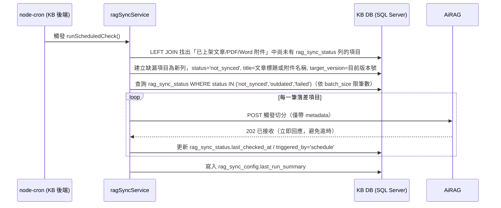
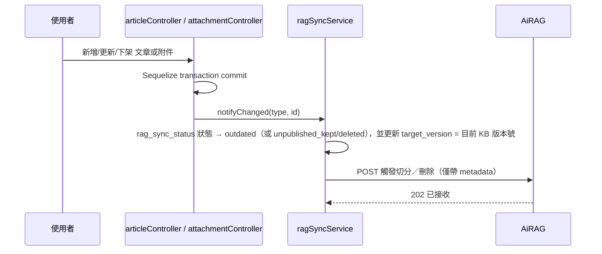
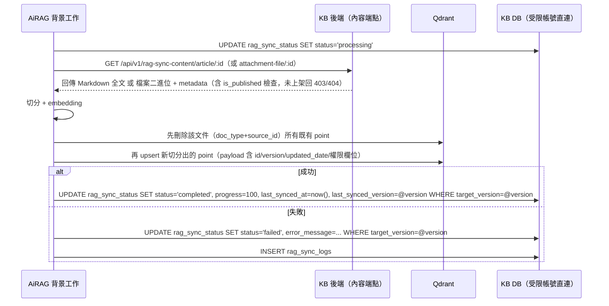
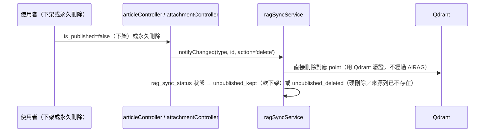
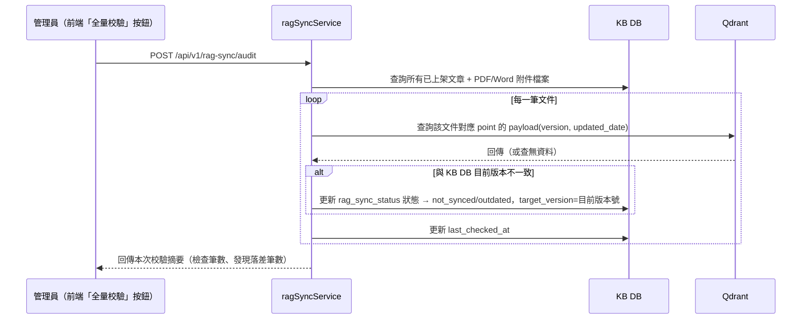

# RAG 向量同步規劃（KB ↔ AiRAG ↔ Qdrant）

## 0. 文件資訊

- **狀態**：KB ↔ AiRAG ↔ Qdrant 端到端已實測成功（2026-07-23，見 v1.6）。KB 端（前端 + 後端）施作完成（TASK-S1～S9、TASK-F1～F3、TASK-D1），AiRAG 端 `POST /api/external/ingest/trigger`、App Registry、內容拉取、Qdrant 寫入、`direct_db` 進度回報全部驗證可正常運作。剩餘技術債見 9 節第 6 項（AiRAG 直連 KB DB 暫用 `sa` 帳號）。
- **建立日期**：2026-07-23
- **修訂記錄**：
  - v1.6（2026-07-23）KB ↔ AiRAG ↔ Qdrant 端到端連通測試，過程中發現並修正 5 處雙方組態落差：
    1. KB 端 `AIRAG_BASE_URL` 若帶結尾斜線會讓組出的觸發路徑變成 `//api/...` 而 404，`aiRagIngestClient.js` 補上去除結尾斜線的防呆。
    2. KB 端文章/附件的 `access_members` 部分舊資料曾被重複 `JSON.stringify`，導致取出仍是字串（如 `"[]"`）而非陣列，AiRAG 端 pydantic schema 要求陣列會 422；新增 `accessHelper.js` 的 `normalizeAccessMembers()`，`ragSyncService.js` 與內容端點皆已套用。
    3. AiRAG 端 MongoDB 原本完全沒有 `app_id="kb"` 的 App Registry 登錄（只有測試用 `bpm_test`），已補登（`base_url`、`article/{id}`、`attachment-file/{id}` 路徑樣板、`report_mode="direct_db"`）。
    4. AiRAG 端 `AIRAG_INGEST_API_KEY` 驗證的是 MongoDB `external_api_keys` collection 的 bcrypt hash，非單純環境變數比對；已用該金鑰明碼建立對應的 `scope="ingest"` 金鑰紀錄。
    5. AiRAG 的 `worker`/`backend` container 用 bind mount 讀 `.env`（非 `env_file:` 注入），新增/修改變數後仍需重啟 container 才會重新 `load_dotenv()`；且 container 內只安裝 FreeTDS（`/etc/odbcinst.ini` 僅註冊 `[FreeTDS]`），`direct_db` 回報用的 `KB_DB_CONNECTION_STRING` 需用 `DRIVER={FreeTDS}` 而非 `DRIVER={ODBC Driver 17 for SQL Server}`（後者在 container 內找不到會報 file not found）。
    完成上述修正後，以 KB 文章 id=32 實測：`notifyChanged` → AiRAG 觸發（202）→ 背景任務抓取 KB 內容 → 切分/embedding → 寫入 Qdrant（含刪除舊 66 點再重新 upsert 66 點的清理邏輯）→ AiRAG 直連 KB DB 回報 → KB `rag_sync_status` 正確轉為 `status='completed', progress=100, last_synced_version=3`，全流程無需人工介入。⚠️ 本次為求快速打通，AiRAG 端 `KB_DB_CONNECTION_STRING` 暫時沿用 `SQLSERVER_CONNECTION_STRING` 同一組 `sa` 帳號，未依 6.4 節建議建立最小權限受限帳號，見 9 節第 6 項技術債。
  - v1.5（2026-07-23）KB 端施作完成：三張表 / `qdrantService.js` / `aiRagIngestClient.js` / `ragSyncService.js` / 內容端點 / 管理端 API / 排程 / 文章與附件 CRUD 串接（後端）；`ragSyncService`（api.js）/ `AdminView.vue` 三個新 tab / `ArticleView.vue`、`AttachmentView.vue` 同步狀態徽章（前端）；`docs/04_DB_SCHEMA.md`、`docs/03_API_CONTRACT.md` 已補上新表與新端點。已用真實 KB DB 資料驗證：內容端點的 `is_published` 檢查、`X-RAG-Sync-Key` 驗證、`notifyChanged`/`runScheduledCheck`/`runFullAudit`/`executeManual` 皆能正確寫入 `rag_sync_status`/`rag_sync_logs`，並在 AiRAG 端點與 Qdrant 憑證尚未就緒時正確捕捉失敗、不影響文章/附件既有 CRUD 流程。尚未能驗證的部分：AiRAG 實際觸發切分與 Qdrant 實際寫入/查詢（等待 AiRAG 端開放端點與使用者提供 Qdrant 憑證）。
  - v1.4（2026-07-23）依 `MULTI_APP_RAG_SYNC_PLAN.md` v1.2 對齊稽核結果修正 3 處欄位/Header 落差：1) 4.4 節 `article/:id` 回應補上 `appId`/`docType`/`sourceId`，`versionNumber` 更名為 `version`（對齊 MULTI_APP 2.2 節契約，本端點尚未實作，改名零成本）；2) 4.4 節 `attachment-file/:id` 回應 Header 補上 `X-Doc-App-Id`；3) 6 節第 4 點 Qdrant payload 需求清單補上 `app_id`（由 AiRAG 依觸發請求的 `appId` 自動寫入，KB 端不需額外處理）。另於 6 節第 2 點註記：本文件的 `article/:id`、`attachment-file/:id` 路徑已於 AiRAG 端「App Registry」（見 `MULTI_APP_RAG_SYNC_PLAN.md` 2.4 節）原樣登錄，不需要改成通用路徑命名。上一版遺留的 `doc_type`/`docType` 命名風格差異，已於 `MULTI_APP_RAG_SYNC_PLAN.md` 2026-07-23 決策中確認為刻意設計（HTTP 傳輸層 camelCase、Qdrant payload snake_case，AiRAG 內部轉換），非待修正項目。
  - v1.3（2026-07-23）檢查 v1.2 對齊結果，修正 3 處遺漏：1) `AIRAG_BASE_URL` 範例改為不含 `/api` 後綴，避免與 v1.2 新路徑 `POST /api/external/ingest/trigger` 疊加成 `/api/api/...`；2) 新增 `AIRAG_KNOWLEDGE_BASE_ID` 環境變數，補上 v1.2 payload 新欄位 `knowledgeBaseId` 原本未定義的來源；3) 2.1 節排程建立缺漏列時補上同步寫入 `title`。另將 `MULTI_APP_RAG_SYNC_PLAN.md` 的連結改為純文字說明（該檔案不在本 repo 內，原連結為死連結）。`doc_type`/`source_id`（Qdrant point payload，見 6 節第 4 點）與 `docType`/`sourceId`（觸發請求，見 6 節第 1 點）命名風格不一致，待與 AiRAG 端確認是否也要統一，暫不強改。
  - v1.2（2026-07-23）對齊 `MULTI_APP_RAG_SYNC_PLAN.md` 通用規範決策：1) `rag_sync_status` 新增 `title` 欄位（NVARCHAR(500)），填入文章標題或附件名稱 `name`；2) 觸發端點路徑定案為 `POST /api/external/ingest/trigger`；3) 觸發 Payload 欄位命名對齊通用契約（`appId: "kb"`, `docType`, `sourceId`, `title`, `targetVersion` 等）。
  - v1.1（2026-07-23）依外部審查意見修訂 4 項設計：Qdrant 舊 chunk 清理、排程效能（拆分輕量重試／全量校驗）、AiRAG 進度回報競態條件（新增 `target_version` 鎖定機制）、權限欄位補齊 `access_members` 與內容端點 `is_published` 檢查。詳見「10. 外部審查意見採納紀錄」。
- **目標**：將知識庫（KB）已上架的文章與附件（PDF/Word）同步寫入向量資料庫 Qdrant，並建立排程機制定期比對 KB DB 與 Qdrant 的 `id`、`version`、`updated_date` 是否一致。
- **範圍聲明**：
  - 本文件涵蓋 **KB 前端（`frontend/`）** 與 **KB 後端（`backend/`）** 的變更規劃，可直接依「7. AI 執行步驟」施作。
  - **AiRAG 專案**（獨立 Python FastAPI repo，本 repo 不含其原始碼）僅在「6. AiRAG 專案協作需求」章節做**需求記錄與介面約定**，實際實作需由 AiRAG 維護者在其專案內完成，不在本次施作範圍。
  - 文件內多處標註「⚠️ 待確認」的段落，是依現有程式碼與使用者需求**推論出的設計**，非使用者逐字確認過的規格，動工前建議先過目「9. 待確認事項總表」。
- **相關文件**：[docs/02_ARCHITECTURE.md](../02_ARCHITECTURE.md)（系統架構，尚未反映本次變更）、[docs/03_API_CONTRACT.md](../03_API_CONTRACT.md)、[docs/04_DB_SCHEMA.md](../04_DB_SCHEMA.md)、[docs/EXTERNAL_API_INTEGRATION_GUIDE.md](EXTERNAL_API_INTEGRATION_GUIDE.md)（AiRAG 現有問答端點）、[docs/AI_BACKEND_TASK.md](../AI_BACKEND_TASK.md)（TASK 撰寫風格參考）、`MULTI_APP_RAG_SYNC_PLAN.md`（多應用通用規範，**位於 AiRAG 專案 repo，本 repo 內無此檔案**，故不做超連結；如需雙方共同維護建議請 AiRAG 端提供實際存放位置或考慮複製一份到本 repo）

---

## 1. 背景與目標

### 1.1 現況

- KB 後端（Node.js + Express + Sequelize）將文章（`Article`）與附件（`Attachment`/`AttachmentFile`）資料存於 SQL Server（KB DB），目前**沒有任何向量化或搜尋索引**。
- AiRAG 是另一個獨立的 Python FastAPI 專案，已提供 `POST /api/external/chat`（問答，見 [EXTERNAL_API_INTEGRATION_GUIDE.md](EXTERNAL_API_INTEGRATION_GUIDE.md)），底層使用 Qdrant 做向量檢索，但**目前尚未開放任何寫入/建索引端點**。
- 前端已有 `frontend/src/services/AiRAGApi.js` 直接呼叫 AiRAG 問答端點（用固定 `knowledge_base_id`），但這與本次「把 KB 自己的文章/附件寫進 AiRAG 的向量庫」是不同的事——現況等於是 AiRAG 目前檢索到的知識庫內容**還沒有包含 KB 系統自己的文章附件**。

### 1.2 目標

1. 將 KB 已上架（`is_published=true`）的文章與 PDF/Word 附件檔案，透過 AiRAG 切分、embedding 後寫入 Qdrant。
2. 建立排程機制，定期比對 KB DB 與 Qdrant 之間 `id`／`version`／`updated_date` 是否一致，抓出「Qdrant 沒資料」「已過期未更新」等落差並自動觸發重新同步。
3. 文章/附件下架或刪除時，同步移除 Qdrant 內對應的 point。
4. 提供管理介面：排程設定、比對狀態總覽（可手動指定重新執行）、錯誤 Log 查詢。
5. 文章/附件詳情頁面顯示是否已寫入 RAG。

### 1.3 角色分工總覽

| 角色 | 負責項目 | 資料存取 |
|---|---|---|
| **KB 後端**（本次施作） | 比對 KB DB vs Qdrant、通知 AiRAG 進行切分、提供文章/附件內容給 AiRAG 拉取、下架時直接刪除 Qdrant point、排程與管理 API | Sequelize 讀寫 KB DB；直連 Qdrant（讀 + 刪）；HTTP 呼叫 AiRAG |
| **AiRAG**（僅記錄需求） | 實際切分、embedding、寫入 Qdrant point；回報進度 | 直連 KB DB（僅限比對相關 2 張新表，見 6.4）；讀寫 Qdrant |
| **使用者 / 維運** | 提供 Qdrant IP、API Key；建立 AiRAG 用的受限 KB DB 帳號；AiRAG 側開發排期 | — |

---

## 2. 整體流程

### 2.1 排程比對流程（輕量版，預設 cron 執行）

> ⚙️ **v1.1 修訂**：原設計每次排程都對所有已上架文件逐一查 Qdrant 比對，文件量大時會造成大量 Qdrant API 請求、排程執行過久（詳見「10. 外部審查意見採納紀錄」第 2 點）。改為「DB 狀態驅動為主」：排程只查 KB DB 本地狀態就能決定要不要重試，**不需要每次都連線 Qdrant**；真正對 Qdrant 做全量比對的邏輯移到 2.5 節的「全量校驗」，改為管理員手動觸發。



### 2.2 即時觸發流程（文章/附件異動）



> ⚙️ **v1.1 修訂**：`target_version` 是本次新增欄位，用來避免「快速連續編輯（V1→V2→V3）時，V2 較晚完成的回報覆蓋掉 V3 尚未完成的狀態」這種競態條件，詳見 2.3 節與「10. 外部審查意見採納紀錄」第 3 點。

### 2.3 AiRAG 非同步處理流程（僅記錄，AiRAG 側實作）



> ⚙️ **v1.1 修訂**：新增兩項防護，皆詳列於「10. 外部審查意見採納紀錄」：
> 1. **舊 chunk 殘留清理**：若某次更新讓切分出的 chunk 數變少（例如 10 個減為 8 個），只做 upsert 只會覆蓋前 8 個 point，第 9、10 個舊 point 會殘留在 Qdrant 中並持續被搜尋到。因此 AiRAG 每次 upsert 前，必須先依 `doc_type + source_id` 刪除該文件全部既有 point，再寫入新切分結果。
> 2. **`target_version` 防競態鎖定**：AiRAG 寫回 `completed`/`failed` 時，UPDATE 必須加上 `WHERE target_version = @version`（`@version` 為這次任務實際處理的版本號）。若 KB 後端在此期間已因更新的版本重新標記 `outdated` 並寫入新的 `target_version`，這個 WHERE 條件會不吻合、UPDATE 影響 0 筆，避免舊任務的遲到回報把新版本的 `outdated` 狀態誤蓋成 `completed`。

### 2.4 下架 / 刪除流程



> ⚠️ 待確認：下架（`is_published=false`）與永久刪除目前在 KB 後端**只有前者已實作**；`AdminView.vue` 的「垃圾桶管理」永久刪除按鈕目前是「功能建置中，尚未串接後端」的假按鈕。本規劃先定義好 `unpublished_deleted` 狀態的語意（來源列在 SQL 中已查無資料），實際觸發時機等 KB 後端真正做出永久刪除功能後才會發生；在那之前，實務上只會出現 `unpublished_kept`。

### 2.5 全量校驗流程（新增，管理員手動觸發）

> ⚙️ **v1.1 新增**：2.1 節的排程只信任 KB DB 本地狀態，不會發現「本地狀態顯示 `completed`，但 Qdrant 實際上沒有對應 point」這種漂移（例如 Qdrant 端資料被人手動刪改、或 AiRAG 曾經靜默失敗但沒有正確回報）。這種真正需要比對 Qdrant 實際資料的檢查，改為管理員在「同步比對」介面按下「全量校驗」時才執行，不放進每小時的排程，避免文件量大時拖垮排程效能。



---

## 3. 資料庫 Schema（新增 3 張表，KB DB / MSSQL）

> 命名慣例延續 [docs/04_DB_SCHEMA.md](../04_DB_SCHEMA.md)：資料表與欄位皆用 `snake_case`。三張表均**無實體 FK 約束**（比照既有 `user_extra_departments` 慣例），因為 `rag_sync_status`/`rag_sync_logs` 需同時對應 `articles` 與 `attachment_files` 兩種來源表，且 AiRAG 會用獨立帳號直連寫入。

### 3.1 rag_sync_status（同步比對表，核心）

**所在資料庫：KB DB**

| 欄位 | 型別 | 限制 | 說明 |
|---|---|---|---|
| `id` | `INT` | PK, IDENTITY | |
| `source_type` | `NVARCHAR(20)` | NOT NULL | `'article'` \| `'attachment_file'` |
| `source_id` | `INT` | NOT NULL | `Article.id` 或 `AttachmentFile.id` |
| `parent_attachment_id` | `INT` | NULL | 僅 `attachment_file` 類型使用，指向所屬 `Attachment.id`，用於讀取權限欄位與判斷是否需要重新同步（見 9.1） |
| `title` | `NVARCHAR(500)` | NULL | ⚙️v1.2新增。文章標題或附件檔名（`article` 寫入 `title`，`attachment_file` 寫入附件名稱 `name`），供比對介面呈現 |
| `status` | `NVARCHAR(20)` | NOT NULL, DEFAULT `'not_synced'` | 見 3.1.1 狀態機 |
| `target_version` | `INT` | NULL | ⚙️v1.1新增。KB 後端每次標記需要同步時（`notifyChanged`／排程輕量重試／全量校驗）寫入的「目標版本號」；AiRAG 完成/失敗回報時須以此欄位做條件式 UPDATE，防止競態條件（見 2.2、2.3、9 節） |
| `progress` | `INT` | NULL | 0–100，**由 AiRAG 直連寫入** |
| `last_synced_version` | `INT` | NULL | 最後一次成功同步的版本號快照 |
| `last_synced_at` | `DATETIME2` | NULL | **由 AiRAG 直連寫入** |
| `last_checked_at` | `DATETIME2` | NULL | KB 後端排程最後一次比對時間 |
| `triggered_by` | `NVARCHAR(20)` | NULL | `'schedule'` \| `'manual'` \| `'auto_update'` |
| `error_message` | `NVARCHAR(MAX)` | NULL | 最新一筆失敗原因（**由 AiRAG 直連寫入**），供比對介面快速顯示 |
| `created_at` | `DATETIME2` | NOT NULL, DEFAULT GETDATE() | |
| `updated_at` | `DATETIME2` | NOT NULL, DEFAULT GETDATE() | |

**唯一索引**：`(source_type, source_id)`

#### 3.1.1 狀態機

| 狀態值 | 中文說明 | 誰寫入 |
|---|---|---|
| `not_synced` | Qdrant 沒資料 | KB 後端（排程比對時） |
| `outdated` | 已過期未更新（KB 版本 ≠ Qdrant 版本） | KB 後端 |
| `processing` | 切分寫入中 | AiRAG |
| `completed` | 已完成 | AiRAG |
| `failed` ⚠️ | 切分或寫入失敗，需人工重試 | AiRAG |
| `unpublished_kept` | 下架未刪除 | KB 後端 |
| `unpublished_deleted` | 下架已刪除（來源列已不存在） | KB 後端 |

> ⚠️ **待確認**：`failed` 為本規劃新增建議，使用者原始需求只列了 6 種狀態。若不新增 `failed`，失敗案例會停在 `processing` 無法被比對介面辨識與重試，故建議採用；若使用者不需要區分失敗，可退回用 `outdated` 代替並靠 `error_message` 是否有值判斷。

**DDL**

```sql
CREATE TABLE rag_sync_status (
    id                    INT             IDENTITY(1,1)  PRIMARY KEY,
    source_type           NVARCHAR(20)    NOT NULL,
    source_id             INT             NOT NULL,
    parent_attachment_id  INT             NULL,
    title                 NVARCHAR(500)   NULL,
    status                NVARCHAR(20)    NOT NULL  DEFAULT 'not_synced',
    target_version        INT             NULL,
    progress              INT             NULL,
    last_synced_version   INT             NULL,
    last_synced_at        DATETIME2       NULL,
    last_checked_at       DATETIME2       NULL,
    triggered_by          NVARCHAR(20)    NULL,
    error_message         NVARCHAR(MAX)   NULL,
    created_at            DATETIME2       NOT NULL  DEFAULT GETDATE(),
    updated_at            DATETIME2       NOT NULL  DEFAULT GETDATE()
);

CREATE UNIQUE INDEX IX_rag_sync_status_source ON rag_sync_status (source_type, source_id);
```

### 3.2 rag_sync_config（排程設定表）

**所在資料庫：KB DB**

先簡化為**固定單筆設定列**（比照 `ai_configs` 概念），不做多組排程。

| 欄位 | 型別 | 限制 | 說明 |
|---|---|---|---|
| `id` | `INT` | PK, IDENTITY | |
| `cron_expression` | `NVARCHAR(50)` | NOT NULL, DEFAULT `'0 * * * *'` | node-cron 表達式，預設每小時執行一次 |
| `is_enabled` | `BIT` | NOT NULL, DEFAULT 1 | 是否啟用排程 |
| `batch_size` | `INT` | NOT NULL, DEFAULT 20 | 單次排程最多處理幾筆落差項目，避免瞬間大量觸發 AiRAG |
| `last_run_at` | `DATETIME2` | NULL | 最後一次排程執行時間 |
| `last_run_summary` | `NVARCHAR(MAX)` | NULL | JSON 字串，記錄該次新增/更新/刪除/失敗筆數，例如 `{"checked":50,"triggered":3,"failed":0}` |
| `updated_by` | `NVARCHAR(50)` | NULL | 最後修改設定的員工工號 |
| `created_at` | `DATETIME2` | NOT NULL, DEFAULT GETDATE() | |
| `updated_at` | `DATETIME2` | NOT NULL, DEFAULT GETDATE() | |

**DDL**

```sql
CREATE TABLE rag_sync_config (
    id                 INT             IDENTITY(1,1)  PRIMARY KEY,
    cron_expression    NVARCHAR(50)    NOT NULL  DEFAULT '0 * * * *',
    is_enabled         BIT             NOT NULL  DEFAULT 1,
    batch_size         INT             NOT NULL  DEFAULT 20,
    last_run_at        DATETIME2       NULL,
    last_run_summary   NVARCHAR(MAX)   NULL,
    updated_by         NVARCHAR(50)    NULL,
    created_at         DATETIME2       NOT NULL  DEFAULT GETDATE(),
    updated_at         DATETIME2       NOT NULL  DEFAULT GETDATE()
);
```

### 3.3 rag_sync_logs（錯誤 / 事件 Log）

**所在資料庫：KB DB**

| 欄位 | 型別 | 限制 | 說明 |
|---|---|---|---|
| `id` | `INT` | PK, IDENTITY | |
| `source_type` | `NVARCHAR(20)` | NULL | 同 `rag_sync_status.source_type`，系統性錯誤可為 NULL |
| `source_id` | `INT` | NULL | |
| `stage` | `NVARCHAR(30)` | NOT NULL | `compare`／`notify`／`fetch_content`（KB 後端寫）；`chunking`／`embedding`／`qdrant_upsert`（AiRAG 直連寫） |
| `level` | `NVARCHAR(10)` | NOT NULL, DEFAULT `'error'` | `info`／`warning`／`error` |
| `message` | `NVARCHAR(MAX)` | NOT NULL | 錯誤或事件內容 |
| `occurred_at` | `DATETIME2` | NOT NULL, DEFAULT GETDATE() | |

**DDL**

```sql
CREATE TABLE rag_sync_logs (
    id            INT             IDENTITY(1,1)  PRIMARY KEY,
    source_type   NVARCHAR(20)    NULL,
    source_id     INT             NULL,
    stage         NVARCHAR(30)    NOT NULL,
    level         NVARCHAR(10)    NOT NULL  DEFAULT 'error',
    message       NVARCHAR(MAX)   NOT NULL,
    occurred_at   DATETIME2       NOT NULL  DEFAULT GETDATE()
);

CREATE INDEX IX_rag_sync_logs_occurred_at ON rag_sync_logs (occurred_at DESC);
```

### 3.4 與既有表的關聯（邏輯關聯，非實體 FK）

```
articles.id              ──▶ rag_sync_status.source_id (source_type='article')
attachment_files.id      ──▶ rag_sync_status.source_id (source_type='attachment_file')
attachment_files.attachment_id ──▶ rag_sync_status.parent_attachment_id
```

---

## 4. 後端（`backend/`）變更清單

### 4.1 新增檔案

| 檔案 | 說明 |
|---|---|
| `backend/src/models/RagSyncStatus.js` | `rag_sync_status` model，寫法比照 `backend/src/models/AiConfig.js`（`sequelize.define`，snake_case 欄位，`timestamps:true`） |
| `backend/src/models/RagSyncConfig.js` | `rag_sync_config` model |
| `backend/src/models/RagSyncLog.js` | `rag_sync_logs` model，`timestamps:false`（只有 `occurred_at`） |
| `backend/src/services/qdrantService.js` | 封裝 `@qdrant/js-client-rest`：`findPointMeta(type, id)` 查單一文件目前 Qdrant 上的 `version`/`updated_date`；`deletePointsByDoc(type, id)` 依 payload filter 刪除該文件所有 point |
| `backend/src/services/aiRagIngestClient.js` | 封裝呼叫 AiRAG 觸發端點 `${AIRAG_BASE_URL}/api/external/ingest/trigger`（見 6.1，`AIRAG_BASE_URL` 不含 `/api` 後綴，見 4.3 註解），payload 固定帶入 `knowledgeBaseId: process.env.AIRAG_KNOWLEDGE_BASE_ID`（⚙️v1.2新增），短逾時（5–10 秒），只等待 ACK，不等待實際切分完成 |
| `backend/src/services/ragSyncService.js` | 核心邏輯：`runScheduledCheck()`（2.1 輕量重試，僅查 KB DB 本地狀態）、`runFullAudit()`（2.5 全量校驗，逐筆查 Qdrant，⚙️v1.1新增）、`notifyChanged(type, id, action)`（含寫入 `target_version`）、`executeManual(items)`、`getStatusMap(type, ids)`、`rescheduleCron()` |
| `backend/src/controllers/ragSyncController.js` | 管理端點 handler（config/status/logs/manual-execute/**audit**，⚙️v1.1新增 audit）+ AiRAG 對外內容端點 handler（`getArticleContent`/`getAttachmentFileContent`，含 `is_published` 檢查） |
| `backend/src/routes/ragSync.js` | 管理端路由，掛 `authMiddleware + requireRole('ADMIN')`，掛載於 `/api/v1/rag-sync` |
| `backend/src/routes/ragSyncContent.js` | AiRAG 對外拉取內容路由，掛新 middleware（見下），獨立掛載於 `/api/v1/rag-sync-content`（刻意用不同路徑前綴，避免跟 JWT 保護的 `/rag-sync` 群組混淆） |
| `backend/src/middlewares/ragSyncAuth.js` | 驗證 Header `X-RAG-Sync-Key` 是否等於 `process.env.RAG_SYNC_API_KEY`，用於 `ragSyncContent.js` |
| `backend/src/helpers/fileTypeHelper.js` | 抽出 PDF/Word MIME 白名單常數 `SYNCABLE_MIME_TYPES`，供 `routes/ai.js`（既有）與 `ragSyncService.js`（新）共用，避免重複維護同一份陣列 |

### 4.2 修改既有檔案

| 檔案 | 變更內容 |
|---|---|
| `backend/src/models/index.js` | `require` 並註冊 `RagSyncStatus`、`RagSyncConfig`、`RagSyncLog` 三個 model |
| `backend/src/index.js` | 1) 掛載 `app.use('${API}/rag-sync', require('./routes/ragSync'))` 與 `app.use('${API}/rag-sync-content', require('./routes/ragSyncContent'))`；2) 啟動時新增 `RagSyncStatus.sync({force:false})`、`RagSyncConfig.sync({force:false})`、`RagSyncLog.sync({force:false})`；3) 建表完成後呼叫 `ragSyncService.rescheduleCron()` 依 `rag_sync_config` 目前設定註冊 `node-cron` |
| `backend/src/controllers/articleController.js` | 新增/更新/下架流程 transaction commit 成功後，呼叫 `ragSyncService.notifyChanged('article', article.id, action)` |
| `backend/src/controllers/attachmentController.js` | 新增/更新/下架流程成功後，對每個受影響、MIME 屬於白名單的 `AttachmentFile` 呼叫 `ragSyncService.notifyChanged('attachment_file', fileId, action)`；**注意**：即使本次更新沒有新增檔案（只改權限/中繼資料），仍需對該附件包底下所有既有 PDF/Word 檔案觸發通知，因為比對基準是父層 `Attachment` 的版本與更新時間（見 9.1） |
| `backend/src/controllers/articleController.js` / `attachmentController.js` 的列表與單筆查詢方法 | 呼叫 `ragSyncService.getStatusMap(type, ids)`，將同步狀態併入回應物件的 `ragSyncStatus` 欄位 |
| `backend/package.json` | 新增依賴：`node-cron`、`@qdrant/js-client-rest` |
| `backend/.env` | 新增變數（見 4.3，僅列名稱與用途，實際值由使用者/維運填入） |

### 4.3 新增環境變數

```env
# ── AiRAG 整合（本次新增）─────────────────────────────
# ⚠️ 注意：這裡不含 /api 後綴，因為 6 節的觸發端點路徑（POST /api/external/ingest/trigger）
# 已經是完整路徑；若寫成 http://host:port/api 會跟路徑開頭的 /api 重複疊加成 /api/api/...
# （這點與前端 frontend/src/services/AiRAGApi.js 的 AIRAG_BASE_URL 慣例不同，AiRAGApi.js
#   問答用的 base url 本身含 /api，因為它呼叫時路徑不重複帶 /api，兩邊各自獨立設定，不要混用）
AIRAG_BASE_URL=            # AiRAG 主機位址，例如 http://10.10.130.45:53020
AIRAG_INGEST_API_KEY=      # KB 後端呼叫 AiRAG 觸發切分端點用的專屬金鑰（與前端問答用的金鑰分開，見 6 節第 8 點）
AIRAG_KNOWLEDGE_BASE_ID=   # ⚙️v1.2新增。呼叫觸發端點 payload 的 knowledgeBaseId 固定帶入此值，為 ingest 專用知識庫 ID（與前端問答用的 KNOWLEDGE_BASE_ID 是不同的知識庫，不可混用），由 AiRAG 端建立後提供

# ── KB 後端對外提供內容端點（給 AiRAG 拉取用）───────────
RAG_SYNC_API_KEY=          # AiRAG 呼叫 /api/v1/rag-sync-content/* 時需帶的金鑰

# ── Qdrant 直連（比對 / 刪除用）─────────────────────────
QDRANT_URL=                # 使用者另外提供
QDRANT_API_KEY=            # 使用者另外提供
QDRANT_COLLECTION=         # 使用者另外提供的 collection 名稱
```

### 4.4 API 端點（KB 後端新增，格式比照 [docs/03_API_CONTRACT.md](../03_API_CONTRACT.md)）

保護等級符號延續既有慣例，並新增一個給 AiRAG 用的符號：

| 符號 | 說明 |
|---|---|
| 🔓 | 公開端點，不需要驗證 |
| 🔐 | 需要有效 JWT（登入者皆可存取） |
| 🔐👑 | 需要有效 JWT + `ADMIN` 角色 |
| 🔑 | 需要 `X-RAG-Sync-Key` API Key（伺服器對伺服器，供 AiRAG 呼叫，非使用者登入） |

#### 🔐👑 GET `/api/v1/rag-sync/config`
取得目前排程設定。

**Response（成功）**
```json
{
  "success": true,
  "data": {
    "cronExpression": "0 * * * *",
    "isEnabled": true,
    "batchSize": 20,
    "lastRunAt": "2026-07-23T01:00:00Z",
    "lastRunSummary": { "checked": 50, "triggered": 3, "failed": 0 }
  }
}
```

#### 🔐👑 PUT `/api/v1/rag-sync/config`
更新排程設定，儲存後立即呼叫 `rescheduleCron()` 套用新的 cron 表達式。

**Request Body**
```json
{ "cronExpression": "0 * * * *", "isEnabled": true, "batchSize": 20 }
```

#### 🔐👑 GET `/api/v1/rag-sync/status`
比對狀態列表（供「同步比對」介面），支援分頁與篩選。

**Query Params**：`page`、`pageSize`、`status`（可選，篩選狀態）、`sourceType`（可選）、`keyword`（可選，搜尋標題/檔名）

#### 🔐👑 POST `/api/v1/rag-sync/status/execute`
手動指定項目重新執行切分（比對介面的「指定執行切分」）。

**Request Body**
```json
{ "items": [ { "sourceType": "article", "sourceId": 12 }, { "sourceType": "attachment_file", "sourceId": 34 } ] }
```

#### 🔐👑 GET `/api/v1/rag-sync/logs`
錯誤/事件 Log 列表，支援分頁與篩選（`stage`、`level`、日期區間）。

#### 🔐👑 POST `/api/v1/rag-sync/audit`
⚙️v1.1新增。觸發 2.5 節的「全量校驗」，逐筆比對 KB DB 與 Qdrant 實際資料（會實際發出 Qdrant 查詢，執行時間視文件量而定，前端應以非阻塞方式呼叫並顯示執行中狀態）。

**Response（成功，立即回應，實際校驗在背景執行）**
```json
{ "success": true, "message": "全量校驗已開始執行" }
```

#### 🔑 GET `/api/v1/rag-sync-content/article/:id`
供 AiRAG 拉取文章內容。回傳 Markdown 全文與比對用 metadata。**若該文章 `is_published=false`，一律回傳 `404`，不回傳內容**（見「10. 外部審查意見採納紀錄」第 4 點，防止已下架/草稿內容被猜 ID 存取）。路徑本身維持 `article/:id`（見 9 節第 3 項與 `MULTI_APP_RAG_SYNC_PLAN.md` 2.4 節 App Registry，AiRAG 端已原樣登錄此路徑，不需改名）。

**Response（成功）**（⚙️v1.4對齊 `MULTI_APP_RAG_SYNC_PLAN.md` 2.2 節契約，補上 `appId`/`docType`/`sourceId`，`versionNumber` 更名為 `version`）
```json
{
  "appId": "kb",
  "docType": "article",
  "sourceId": 12,
  "title": "文章標題",
  "content": "# Markdown 全文...",
  "version": 3,
  "updatedAt": "2026-07-20T08:00:00Z",
  "permissions": {
    "isPublic": false,
    "accessDept": "IT01",
    "accessLevel": 6,
    "accessMembers": ["S112009", "S220011"]
  }
}
```

#### 🔑 GET `/api/v1/rag-sync-content/attachment-file/:id`
供 AiRAG 拉取附件檔案二進位（直接以 `storage_path` 串流檔案，KB 後端不做文字抽取——切分策略是 AiRAG 的職責）。**若所屬 `Attachment` 的 `is_published=false`，一律回傳 `404`。**路徑本身維持 `attachment-file/:id`（同上，AiRAG 端已原樣登錄）。

**Response**：`Content-Type` 依 `mime_type` 設定，Body 為檔案二進位；並在 Header 附上 `X-Doc-App-Id`（⚙️v1.4新增，固定值 `kb`）、`X-Doc-Version`、`X-Doc-Updated-At`、`X-Doc-Is-Public`、`X-Doc-Access-Dept`、`X-Doc-Access-Level`、`X-Doc-Access-Members`（JSON 字串陣列）供 AiRAG 讀取 metadata（不需另外呼叫一次 JSON API）。

---

## 5. 前端（`frontend/`）變更清單

不新增路由，沿用既有 `frontend/src/views/AdminView.vue`（`meta:{requiresAdmin:true}` 已存在），比照現有「AI 設定」「系統日誌」tab 的殼直接擴充。

### 5.1 修改既有檔案

| 檔案 | 變更內容 |
|---|---|
| `frontend/src/views/AdminView.vue` | 新增 3 個 `el-tab-pane`：<br>1) **同步排程**：cron 表達式輸入、啟用開關、batch size、上次執行摘要，儲存呼叫 `ragSyncService.updateConfig()`<br>2) **同步比對**：`el-table` 列出 `rag_sync_status`（狀態/類型篩選、標題搜尋），可勾選多列後按「指定執行切分」呼叫 `ragSyncService.executeManual(items)`；另加「全量校驗」按鈕呼叫 `ragSyncService.runAudit()`（⚙️v1.1新增，見 2.5、4.4）<br>3) **同步日誌**：`el-table`（篩選 stage/level/日期），呼叫 `ragSyncService.getLogs()` |
| `frontend/src/services/api.js` | 新增 `ragSyncService`：`getConfig()`、`updateConfig()`、`getStatusList(params)`、`executeManual(items)`、`getLogs(params)`、`runAudit()`（⚙️v1.1新增），比照既有 `USE_MOCK` 分支與 snake_case→camelCase `normalizeX()` 慣例 |
| `frontend/src/views/ArticleView.vue`（狀態列，約 207-210 行附近，緊鄰既有「已上架/已下架」「全集團公開/部門私有」`el-tag`） | 新增 RAG 同步狀態 `el-tag`（依 `ragSyncStatus.status` 顯示「RAG 已同步」綠色／「RAG 未同步」灰色／「RAG 處理中」藍色／「RAG 失敗」紅色等） |
| `frontend/src/views/AttachmentView.vue`（附件檔案列表處） | 逐檔顯示 RAG 同步狀態 tag，**僅 PDF/Word 檔案顯示**（Excel 等其他檔案不顯示任何同步標記，因為本來就不會被同步） |

### 5.2 可選（次要，nice-to-have，非必要項）

- `frontend/src/views/HomeView.vue` 搜尋列表的每一列，加上小型同步狀態圖示（不影響核心功能，可視工期決定是否納入）。

---

## 6. AiRAG 專案協作需求（僅記錄，不在本 repo 執行）

以下把使用者提供的原始需求，轉寫為明確的介面契約，供拿去跟 AiRAG 維護者對接：

1. **觸發端點**：需開放 `POST /api/external/ingest/trigger`（⚙️v1.2對齊通用契約），Header 帶 `X-API-Key: AIRAG_INGEST_API_KEY`（見本節第 8 點，用專屬金鑰）。
   ```json
   {
     "appId": "kb",
     "docType": "article",
     "sourceId": 12,
     "title": "文章標題 (附件則帶 name 如 EFGP-ReleaseNote.pdf)",
     "targetVersion": 3,
     "action": "upsert",
     "knowledgeBaseId": "kb_6a389dc83578b9d3d717244d",
     "permissions": {
       "isPublic": false,
       "accessDept": "IT01",
       "accessLevel": 6,
       "accessMembers": ["S112009", "S220011"]
     }
   }
   ```
   `knowledgeBaseId` 固定帶入 `process.env.AIRAG_KNOWLEDGE_BASE_ID`（⚙️v1.2新增，見 4.3），為 ingest 專用知識庫，與前端問答用的 `KNOWLEDGE_BASE_ID`（`frontend/src/services/AiRAGApi.js`）是不同的知識庫。

   **必須立即回應 `202 { "success": true, "message": "Task queued successfully", "taskId": "..." }`**，避免 KB 後端 HTTP 連線因等待實際切分完成而逾時／斷線；實際處理走 AiRAG 內部背景工作。
2. **拉取內容**：收到觸發後，非同步呼叫 KB 後端：
   - 文章：`GET /api/v1/rag-sync-content/article/:id`
   - 附件檔案：`GET /api/v1/rag-sync-content/attachment-file/:id`
   （皆需帶 Header `X-RAG-Sync-Key`，見 4.4）取得要切分的原始內容。⚙️v1.4新增：這兩個路徑**不是**通用命名（`docs/:id`、`attachments/:id`），是 KB 專屬命名；已在 AiRAG 端的 `app_registrations` App Registry 為 `app_id="kb"` 原樣登錄這兩個路徑樣板（見 `MULTI_APP_RAG_SYNC_PLAN.md` 2.4 節），KB 端不需要為了跟其他 App 統一命名而修改路徑。
3. **舊 chunk 清理（⚙️v1.1新增，必要）**：收到 `action='upsert'` 時，**必須先依 `doc_type + source_id` 刪除 Qdrant 中該文件所有既有 point，再寫入新切分出的 point**。若省略這一步，當某次更新讓 chunk 數變少（例如 10 個減為 8 個），只做 upsert 會讓舊版第 9、10 個 point 殘留在 Qdrant 並持續被搜尋到，回傳已刪除或過期的段落內容。
4. **Point payload 新增欄位**：每個 Qdrant point 的 payload 需包含 `app_id`（⚙️v1.4新增，固定值 `"kb"`，由 AiRAG 依觸發請求的 `appId` 自動寫入，**KB 端不需額外處理**，僅為需求清單補齊——遺漏此欄位會讓 `MULTI_APP_RAG_SYNC_PLAN.md` 2.4 節定義的「先依 `app_id`+`doc_type`+`source_id` 刪除舊 point 再 upsert」清理機制對 KB 資料失效或誤刪到其他 App 的資料）、`doc_type`（`article`/`attachment_file`）、`source_id`、`version`、`updated_date`、`is_public`、`access_dept`、`access_level`、`access_members`（⚙️v1.1新增，字串陣列，指定可存取的員工工號清單，來源為 KB DB 的 `access_members` 欄位），供 KB 後端排程比對，也供未來 RAG 檢索做權限過濾用。若遺漏 `access_members`，被指定授權但不屬於 `access_dept`/`access_level` 範圍的使用者，日後在 RAG 問答中會查不到他原本有權限看的文件。
5. **進度回報（直連 KB DB，含防競態條件）**：使用者已決議由 AiRAG 直接連線 KB DB 寫入（見 6.4 安全建議），操作對象僅限 `rag_sync_status`、`rag_sync_logs` 兩張表：
   - 開始處理：`UPDATE rag_sync_status SET status='processing' WHERE source_type=? AND source_id=?`
   - 成功：
     ```sql
     UPDATE rag_sync_status
     SET status = 'completed', progress = 100,
         last_synced_at = GETDATE(), last_synced_version = @version
     WHERE source_type = @source_type AND source_id = @source_id
       AND target_version = @version;
     ```
   - 失敗：同樣需加上 `AND target_version = @version` 條件，`UPDATE rag_sync_status SET status='failed', error_message=? WHERE source_type=? AND source_id=? AND target_version=?`，同時 `INSERT INTO rag_sync_logs (source_type, source_id, stage, level, message) VALUES (...)`
   - ⚙️v1.1新增：**`target_version` 條件是必要的，不可省略**。情境：使用者連續快速編輯同一篇文章（V1→V2→V3），V2 的 AiRAG 任務較晚才處理完成回報時，若沒有 `target_version` 條件保護，會把 KB 後端已經因 V3 寫入的 `outdated` 狀態誤蓋成 `completed`，導致系統誤判 V3 已同步。加上此條件後，若 KB 後端已因更新版本改寫 `target_version`，舊任務的 UPDATE 會因條件不吻合而影響 0 筆，不會覆蓋新狀態。
6. **佇列處理**：同一批觸發要逐筆序列處理（或有限並行），單筆失敗記錄 log 後跳下一筆，不可讓一筆失敗卡住整批排程進度。
7. **Excel 不處理**：Excel 附件不會被 KB 後端送達（已在來源端排除，見 4.1 `fileTypeHelper.js`），AiRAG 端不需額外處理排除邏輯。
8. **金鑰分離提醒**：`docs/EXTERNAL_API_INTEGRATION_GUIDE.md` 描述的 `X-API-Key` 是**問答**用途金鑰，目前已寫死於 `frontend/src/services/AiRAGApi.js`。本次 ingest 用途請**另外核發一把獨立金鑰**（`AIRAG_INGEST_API_KEY`），避免共用同一把金鑰導致問答與寫入權限無法分開管控。

### 6.4 安全建議：AiRAG 直連 KB DB 的權限範圍

使用者已決議採用「AiRAG 直接連線 SQL Server 寫入進度」的方案（相較於透過 KB 後端 API 回報，優點是少一次 API 呼叫；取捨是兩個獨立專案需共用同一個資料庫連線與 schema 相容性）。建議：

- 在 SQL Server 建立一組**權限受限**的登入帳號給 AiRAG，僅授予 `rag_sync_status`、`rag_sync_logs` 兩張表的 `SELECT`/`UPDATE`/`INSERT` 權限，**不得存取** `articles`、`attachments`、`attachment_files` 等核心表。
- 此帳號的建立、網路連通性設定**不屬於本 repo 的程式碼變更範圍**，需另外在 SQL Server 端與 AiRAG 部署環境設定，並將連線字串安全地交付給 AiRAG 維護者（不透過本文件或程式碼明文記錄）。

---

## 7. AI 執行步驟（依序 TASK）

比照 [docs/AI_BACKEND_TASK.md](../AI_BACKEND_TASK.md) 的 TASK 風格列出施作順序。**本規劃文件本身不執行任何一項**，待使用者核准後另外開工。

| # | TASK | 內容 | 依賴 |
|---|------|------|------|
| TASK-S1 | Model | 新增 `RagSyncStatus.js`（含 `title` 標題/檔名欄位 ⚙️v1.2、`target_version` 欄位 ⚙️v1.1）、`RagSyncConfig.js`、`RagSyncLog.js`，並在 `models/index.js` 註冊 | — |
| TASK-S2 | Qdrant Client | 安裝 `@qdrant/js-client-rest`，實作 `qdrantService.js`（`findPointMeta`、`deletePointsByDoc`） | 需使用者提供 `QDRANT_URL`/`QDRANT_API_KEY`/`QDRANT_COLLECTION` |
| TASK-S3 | AiRAG Client | 實作 `aiRagIngestClient.js`（呼叫 `POST /api/external/ingest/trigger`，帶 `appId: "kb"`、`title`、`knowledgeBaseId` 等通用契約欄位，短逾時） | 需 AiRAG 開放 6.1 端點 + `AIRAG_INGEST_API_KEY` + `AIRAG_KNOWLEDGE_BASE_ID`（⚙️v1.2新增） |
| TASK-S4 | Core Service | 實作 `ragSyncService.js`：`runScheduledCheck`（2.1 輕量重試）、`runFullAudit`（2.5 全量校驗）、`notifyChanged`（含寫入 `title` 與 `target_version`）、`executeManual`、`getStatusMap`、`rescheduleCron` | TASK-S1~S3 |
| TASK-S5 | Content 端點 | `ragSyncAuth.js` middleware + `ragSyncContent.js` route/controller（AiRAG 拉取內容用，需含 `is_published` 檢查與 `accessMembers` 欄位，⚙️v1.1新增） | TASK-S1 |
| TASK-S6 | 管理端 API | `ragSync.js` route + `ragSyncController.js`（config/status/logs/manual-execute/**audit**，⚙️v1.1新增 audit 端點），掛載至 `index.js` | TASK-S4 |
| TASK-S7 | 排程啟動 | 安裝 `node-cron`，`index.js` 啟動流程整合（建表 + `rescheduleCron()`） | TASK-S1, S4 |
| TASK-S8 | 串接既有 CRUD | `articleController.js`/`attachmentController.js` 的新增/更新/下架流程呼叫 `notifyChanged` | TASK-S4 |
| TASK-S9 | 狀態附加 | `articleController.js`/`attachmentController.js` 列表與單筆查詢附加 `ragSyncStatus` 欄位 | TASK-S4 |
| TASK-F1 | 前端 API | `api.js` 新增 `ragSyncService`（含 `runAudit()`，⚙️v1.1新增） | TASK-S6 |
| TASK-F2 | 管理介面 | `AdminView.vue` 新增「同步排程」「同步比對」（含全量校驗按鈕，⚙️v1.1新增）「同步日誌」3 個 tab | TASK-F1 |
| TASK-F3 | 狀態徽章 | `ArticleView.vue`/`AttachmentView.vue` 顯示同步狀態 tag | TASK-S9, TASK-F1 |
| TASK-F4（可選） | 列表徽章 | `HomeView.vue` 列表加同步狀態小圖示 | TASK-F3 |
| TASK-D1（後續） | 文件維護 | `.env` 說明補登、`docs/04_DB_SCHEMA.md`／`docs/03_API_CONTRACT.md` 補登新表與新 API、`docs/02_ARCHITECTURE.md` 更新 AI 整合架構圖以反映 AiRAG/Qdrant | 全部完成後 |

---

## 8. 驗收清單

- [ ] `backend`：`npm run dev` 啟動無錯誤，`rag_sync_status`/`rag_sync_config`/`rag_sync_logs` 三表自動建立成功
- [ ] 排程依 `rag_sync_config.cron_expression` 定時觸發 `runScheduledCheck()`（可在 log 觀察執行紀錄）
- [ ] `PUT /api/v1/rag-sync/config` 更新 cron 設定後，排程立即套用新頻率（不需重啟服務）
- [ ] `POST /api/v1/rag-sync/status/execute` 手動指定項目可正確觸發（AiRAG 尚未串接前可先用假的/mock 觸發端點驗證呼叫是否送出）
- [ ] 文章/附件新增、更新、下架後，`rag_sync_status` 對應列狀態即時變化
- [ ] `GET /api/v1/rag-sync-content/article/:id`、`/attachment-file/:id` 未帶 `X-RAG-Sync-Key` 時回傳 401
- [ ] 前端 `AdminView.vue` 三個新 tab 可操作（排程設定儲存、比對列表篩選、log 篩選）
- [ ] 文章/附件詳情頁正確顯示 RAG 同步狀態徽章
- [ ] 下架文章/附件後，KB 後端有嘗試呼叫 Qdrant 刪除對應 point（可先用 mock/測試 collection 驗證，避免動到正式資料）
- [ ] `POST /api/v1/rag-sync/audit`（全量校驗）可正確觸發，並能標示出「KB DB 狀態為 completed 但 Qdrant 實際查無資料」的落差（⚙️v1.1新增）
- [ ] `GET /api/v1/rag-sync-content/*` 對 `is_published=false` 的文章/附件回傳 404，不洩漏內容（⚙️v1.1新增）
- [ ] 內容端點回應（及 6.1 觸發payload範例）已包含 `accessMembers`/`access_members` 欄位（⚙️v1.1新增，需與 AiRAG 端對齊）
- [ ] 已與 AiRAG 維護者確認：upsert 前會先清除該文件舊 point、進度回報 UPDATE 已加上 `target_version` 條件（⚙️v1.1新增，屬 AiRAG 側實作，本 repo 僅能在介面契約中要求，無法在 KB 後端測試中直接驗證）

---

## 9. 待確認事項總表

| # | 項目 | 本文件採用的設計 | 為何需要確認 |
|---|------|------------------|--------------|
| 1 | 附件比對基準 | 用父層 `Attachment` 的 `version_number`/`updated_at`，而非 `AttachmentFile` 自己的欄位 | 因權限欄位只在 `Attachment` 上，若只看檔案自身版本號，權限異動（未新增檔案）會偵測不到；此為推論設計 |
| 2 | 狀態機新增 `failed` | 新增第 7 種狀態，區隔於 `processing` | 使用者原始需求僅列 6 種狀態，未提及失敗態 |
| 3 | KB 後端 ↔ AiRAG 傳遞方式 | 推播通知（僅 metadata）＋ AiRAG 反向拉取內容，非一次把檔案內容整包塞進通知請求 | 為推論出的介面設計，需與 AiRAG 開發者對齊實際簽章 |
| 4 | Qdrant 比對效能 | ⚙️v1.1修訂：排程預設只做 DB 驅動的輕量重試（2.1 節，不查 Qdrant），逐文件查 Qdrant 的全量比對改為管理員手動觸發「全量校驗」（2.5 節） | 原設計每次排程都對所有文件查 Qdrant，文件量大時會造成大量請求與排程延遲，已依審查意見修訂為兩層設計 |
| 5 | KB 後端不引入佇列系統 | 排程內用簡單迴圈依序處理，佇列邏輯（一筆一筆、失敗跳過）規劃在 AiRAG 側 | 現有專案未安裝 Redis，避免不必要的基礎設施 |
| 6 | AiRAG 直連 SQL Server 憑證範圍 | 建議受限帳號僅能存取 `rag_sync_status`/`rag_sync_logs`；⚠️ **目前 AiRAG 端 `KB_DB_CONNECTION_STRING`（`AiRAG/backend/.env`）暫時沿用既有 `sa` 全權帳號**，尚未建立最小權限受限帳號，屬已知技術債，待建立受限登入後應替換 | 使用者已決議直連寫入，此為對應的安全建議，需維運端落實；2026-07-23 端到端測試時為求快速打通先用 sa 帳號 |
| 7 | Excel 附件 | 完全不建立比對列、不出現在比對介面 | 符合「excel不做」，明確排除而非顯示「不支援」 |
| 8 | 永久刪除功能現況 | `unpublished_deleted` 狀態語意已定義，但目前 KB 後端尚無真正的永久刪除功能（`AdminView.vue` 垃圾桶「永久刪除」按鈕尚未串接後端） | 實務上此狀態近期不會被觸發，待永久刪除功能完成後才會出現 |

---

## 10. 外部審查意見採納紀錄

本文件 v1.0 完成後，經過一輪外部審查，共 5 點意見，評估後採納 4 點、1 點確認已涵蓋在原設計中。以下記錄採納理由與對應修訂位置，供之後回溯查閱。

| # | 審查意見 | 評估結論 | 對應修訂 |
|---|---|---|---|
| 1 | Qdrant 舊 chunk 殘留：版本更新後 chunk 數變少時，upsert 不會清掉多餘的舊 point | **採納**。這是真實的正確性問題，會導致搜尋到已刪除/過期段落 | 2.3 節流程圖新增「先刪除舊 point 再 upsert」步驟；6 節第 3 點新增為 AiRAG 必要需求 |
| 2 | 排程比對的 N+1 效能瓶頸：每次排程都對所有文件查 Qdrant，文件量大時會拖垮排程 | **採納，但簡化為比審查建議更輕量的做法**：不做雙頻率 cron，而是拆成「排程只查本地 DB 狀態」（2.1）＋「Qdrant 全量比對改為管理員手動觸發」（2.5），避免額外增加排程設定複雜度 | 重寫 2.1 節；新增 2.5 節；新增 `POST /api/v1/rag-sync/audit` 端點與前端「全量校驗」按鈕；更新 9 節第 4 項 |
| 3 | 非同步進度回報的競態條件：連續快速編輯時，較舊版本的完成回報可能覆蓋較新版本的 outdated 狀態 | **採納，且改用比審查建議更嚴謹的鎖定方式**：審查建議的 `last_synced_version <= @current_version` 只能防止版本號倒退，無法阻止舊任務把新版本的 `outdated` 狀態誤蓋成 `completed`。改為新增 `target_version` 欄位，AiRAG 回報時須以 `WHERE target_version = @version` 為條件，版本不吻合時 UPDATE 直接影響 0 筆 | `rag_sync_status` 新增 `target_version` 欄位（3.1 節）；2.2、2.3 節流程圖更新；6 節第 5 點附上完整 SQL |
| 4 | 權限欄位遺漏 `access_members`；內容端點未規範 `is_published` 檢查 | **兩項皆採納**。`access_members` 遺漏會讓被指定授權但不屬於部門/職級範圍的使用者，日後在 RAG 問答查不到自己有權限的文件；內容端點若不檢查 `is_published`，未上架/草稿內容可能被猜 ID 存取 | 4.4／6 節的 payload 與回應範例補上 `accessMembers`；4.4 節內容端點新增「`is_published=false` 一律回傳 404」的規範 |
| 5 | 附件比對基準應以父層 `Attachment` 為準，且要在控制器層明確要求對既有檔案觸發通知 | **確認已涵蓋，不需修改**。原文件 4.2 節已明確寫「即使沒有新增檔案，仍需對既有 PDF/Word 檔案觸發通知」，方向與審查意見一致 | 無變更 |
